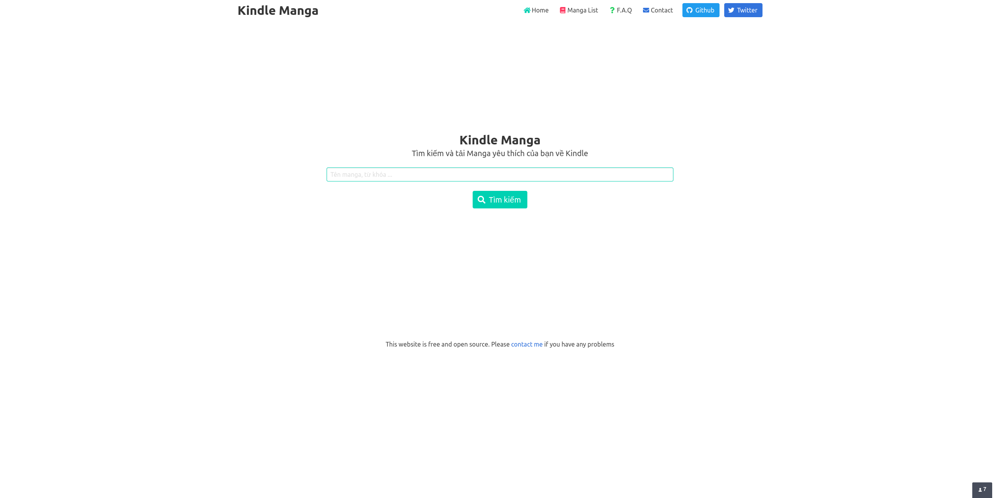
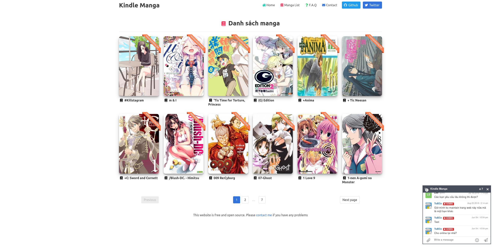
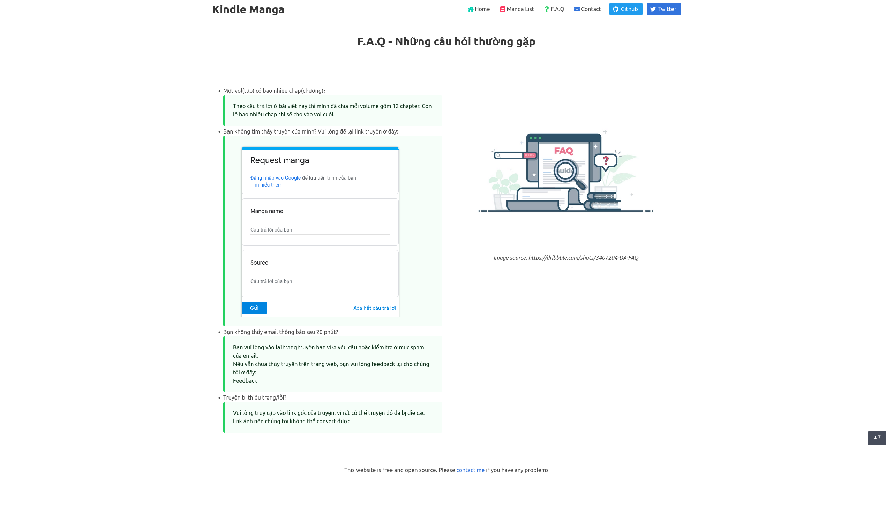

# Kindlemanga 1.0 - Bring manga to you Kindle.

Generate _Kindle_ friendly manga. Good for your eyes and your feelings.

# Demo

Visit [kindlemanga.xyz](https://kindlemanga.xyz)

# Dev guide

Fill your ENV variables to `.envs/.local/.django`, then run

`docker-compose -f local.yml up --build -d`

Then you can access the website at `localhost:8000`

SSH to docker container

`docker-compose -f local.yml run --rm django bash`

After SSH, cd to `/crawler/manga_crawler` if you want to run crawlers with `scrapy`.

(Example: `scrapy crawl mangaseeonline`)

# How to

#### Step 1:

Search your favorite manga

#### Step 2:

Enter your Kindle Email(Coming soon) or your Email.

#### Step 3:

We will send the manga directly to your Kindle, or notify to your Email when your Manga ready to download.

#### Step 4:

Let's read!!

# Development

This project is base on KCC and Django. Please contribute as much as you want!
